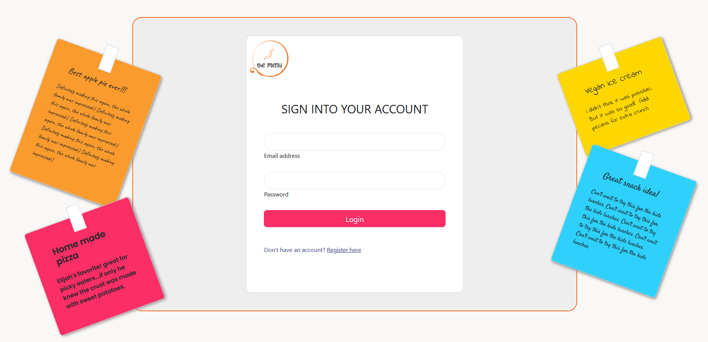
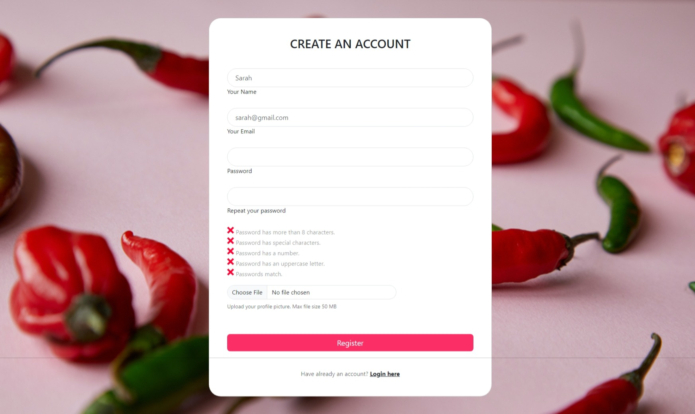
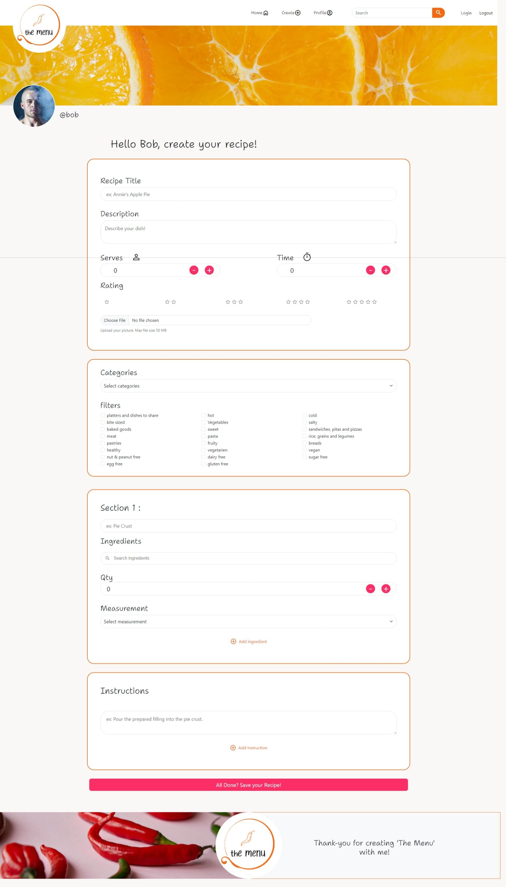
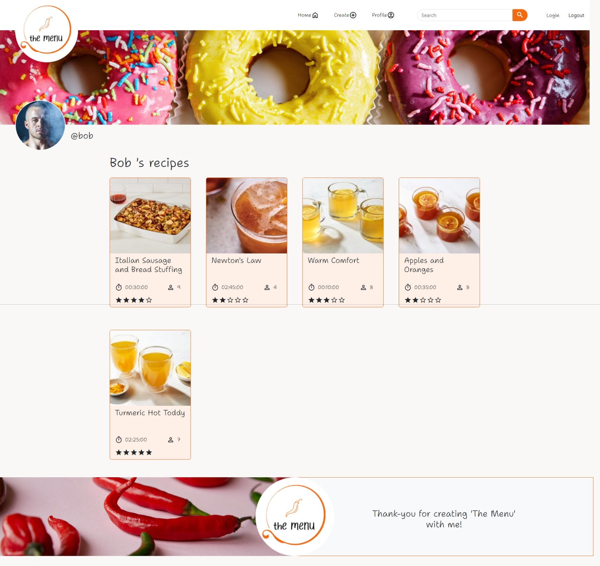
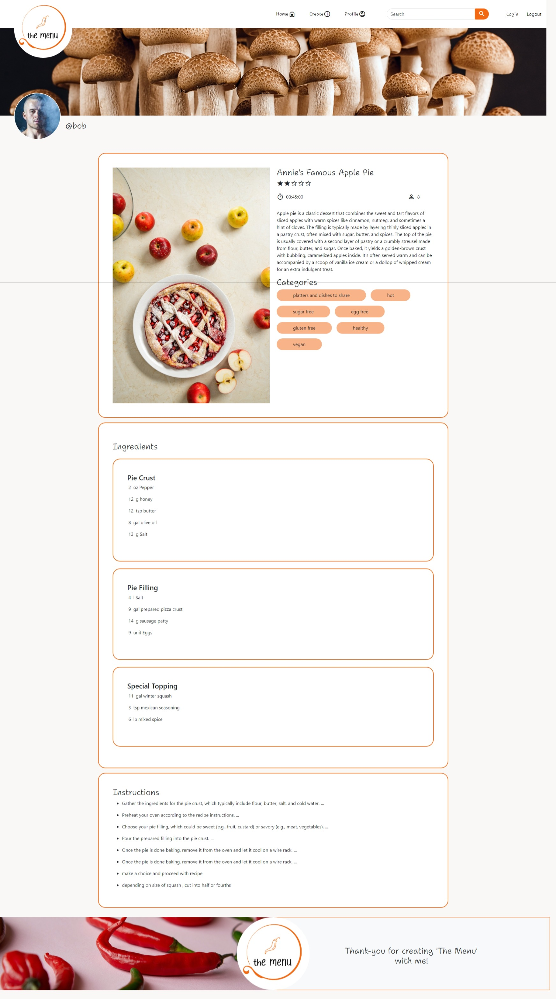

# The Menu - A Recipe App

<h1>Internship project: REACT, Typescriipt & Bootstrap</h1>

Welcome to my recipe application 'The Menu,' a platform dedicated to cooking enthusiasts and lovers of unique flavors. My project aims to create an immersive experience, enabling the creation, customization, and sharing of recipes for an unforgettable culinary adventure.

My goal is to create a user-friendly platform where culinary creativity meets community conviviality. Join us in this culinary adventure and discover the art of sharing, creating, and savoring unique recipes crafted to your tastes and preferences.

In Phase 1, the application offers the possibility to design your own recipes while creating a secure personal account. This initial step allows you to shape your culinary ideas, save your creations, and begin exploring a variety of flavors in your own way.

Phase 2 goes further by providing means to customize both the content and the aesthetics of your recipes. Imagine a range of options allowing you to choose colors, borders, and fonts, adding a unique touch to your culinary creations.

Finally, Phase 3 opens the doors to collaboration and sharing within our community. You'll be able to save recipes from other members, organize them in your personal space, and share them with your friends or other cooking enthusiasts.

 This repo consists of phase one.

## Phase 1: Recipe Creation with User Accounts

### The primary objective of Phase 1 is to enable users to create and store their own recipes within the application.

#### Key functionalities include:

- Recipe Creation Interface: A user-friendly interface allowing users to input ingredients, cooking instructions, photos, and other relevant details for their recipes.

- Categorization and Organization: Tools for classifying recipes by type (e.g., breakfast, lunch, dinner, desserts), cuisine, dietary preferences, or other user-defined categories.

- Search and Filtering: A search function allowing users to quickly find their recipes by name, ingredients, or categories.

- User Account Management: Allowing users to create personal accounts.

This phase aims to establish a strong foundation by enabling users to create accounts, facilitating the recording, management, and access to their personal recipes within the application.

## To test out the project:

1. Clone project into your favorite code editor!
2. Retrieve the datbase by importing recette.sql into phpMyAdmin ( it is in the projects docs folder)
3. In the terminal:

   - run frontend server :  npm run dev 
   - run backend server :  php -S localhost:8000 -t public 
   - make sure databse is successfully connected to the project: http://localhost:8000/api/recipes

### Design

#### Login

#### Account Creation

#### Recipe Form

#### Personal page

#### One Recipe

